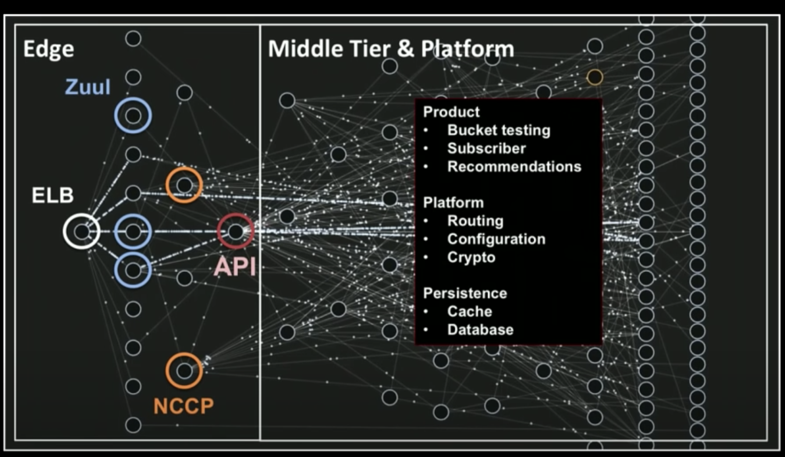
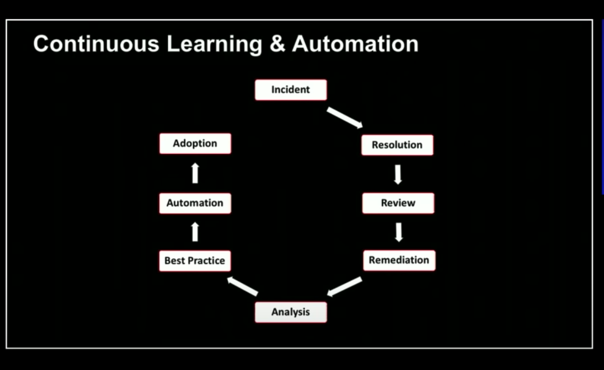
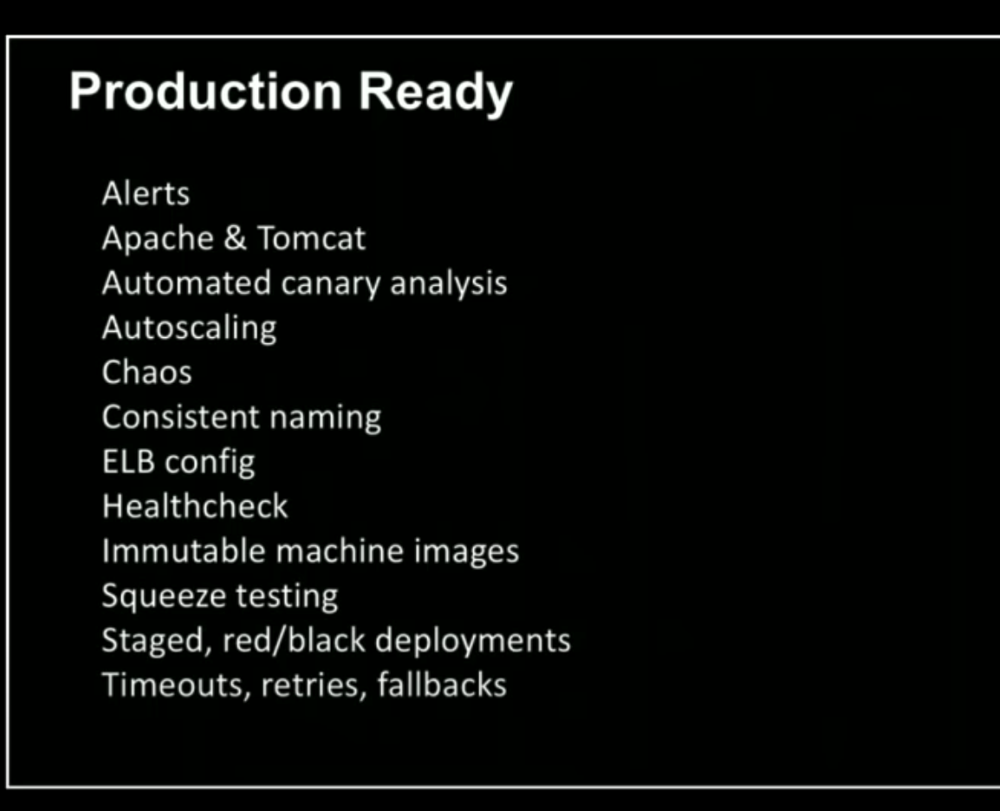
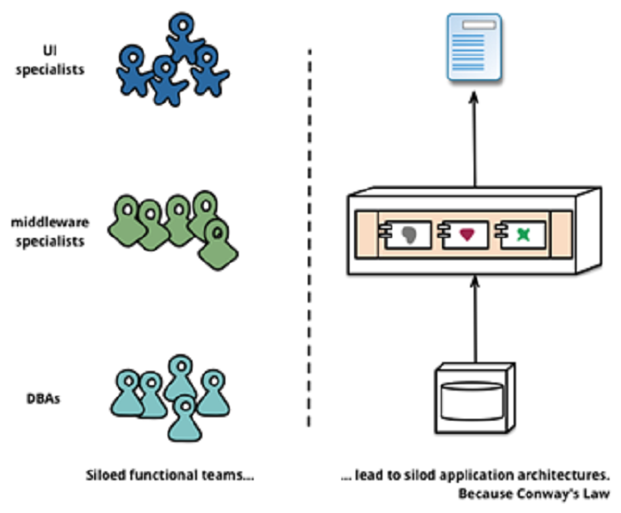

# Mastering Chaos - A Netflix Guide to Microservices

> Author: Lorgio Jimenez

> Source: https://www.youtube.com/watch?v=CZ3wIuvmHeM

Netflix’s first architecture was a monolith like many other applications that get started.

Tightly coupled architecture is a sign of difficulty with a large application and lots of developers

To start really getting the benefits of micro-services, Virtualization is really required.

Product is separate by domain and functionality



Micro-services are an abstraction
In the end a micro service is really a small monolith with possibly some shared libraries

Caching is a different problem to solve. It requires you to take a step back and look at the service overall.

Issues with MS
Intra-service can result is cascading failures.(Setup architecture which can have retries and fallbacks)
Testing scope is difficult to constrain. (Measure critical services only, which reduces permutations)
Shared libraries should be done with caution, and may lead to monoliths.

Persistence
CAP Theorem - Consistent vs Availability Use the right tool for the job (Cassandra)

Infrastructure
Everything fails.

Stateless service
No cache or db, affinity, or node loss.
Autoscaling and replication are table steaks

Stateful service
Db & caches. Custom app which hold large amounts of data
Avoid business logic and state if you can
Loss of node is a big event
Redundancy is fundamental (EVCache)

(ABT) ALWAYS BE TESTING

New functionality can reduce efficiency and add to  operational drift.  

CONTINUOUS LEARNING AND AUTOMATION
Indecent -> Resolution -> Review -> Remediation -> Analysis (new pattern?) -> Best Practice (is this recurring?) -> Automation -> Adoption (knowledge becomes code)



Production Ready Checklist
Automated as much as possible, and tooling to know if things are working


Tooling accelerates engineers and workflows.

The Paved Road (happy path) - Created to make efficiencies with development/deployment.

Going off-road isn’t bad but it needs to be thought through when put into production.

Change
This will break, but how do you achieve velocity with confidence? (Hint: Tooling)

“Solutions first, team second”

Micro-services are complex and organic Health depends on discipline and chaos

For decencies, you want to use circuit breakers and fallbacks.
Simple clients, and eventual consistency.  
Failure Driven design.

Conways Law

