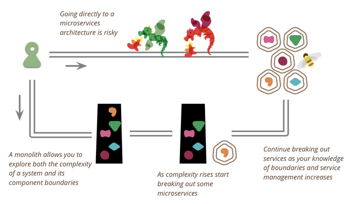

# Monoliths

> Source: https://gist.github.com/spencer1248/d420e01fb40affc40eafd304f4830e3e

> Collections by Spencer

## The Majestic Monolith

> Author: DHH

> Date: Feb 2016

> Source: https://m.signalvnoise.com/the-majestic-monolith/

Microservices are great if you are MASSIVE and have thousands of devs.
Just because it’s good for them, doesn’t mean it’s good for us.
Don’t distribute computing if it can be avoided.

“Every time you extract a collaboration between objects to a collaboration between systems, you’re accepting a world of hurt with a myriad of liabilities and failure states. What to do when services are down, how to migrate in concert, and all the pain of running many services in the first place.”

Case study: Basecamp

Small team, big app (sounds like original flatiron)

Microservices leads to siloing knowledge
*(counterpoint, you still get that in a monolith. There are loads of parts of ironboard I didn’t understand even though I was around when they were being built and I was working on that app)*

## The Majestic Monolith can become The Citadel

> Author: DHH

> Date: April 2020

> Source: https://m.signalvnoise.com/the-majestic-monolith-can-become-the-citadel/

Monoliths may need help when:

- The team grows large and engineers are tripping over each other
  - Maybe the monorepo pattern is a good idea?
- Experiencing performance issues under extreme load

The Citadel - A monolith at the center with outposts to handle extra bits that the monolith cannot tackle. (**Question: Would we consider Ironworker to be the first outpost of Ironboard?**)

The Citadel is waiting for the microservice refugees.

## Stack Overflow: The Architecture - 2016 Edition

> Author: Nick Craver

> Date: Feb 2016

>Source: https://nickcraver.com/blog/2016/02/17/stack-overflow-the-architecture-2016-edition/

SO has their own backup DNS?!?!
Woosh (this one largely flew over my head)

## MonolithFirst

> Author: Martin Fowler

> Date: June 2015

> Source: https://martinfowler.com/bliki/MonolithFirst.html

Monolith -> Microservices has been the move
Microservices from scratch is a 🚮🔥

Microservices shine in more complex systems

Microservices work well if you have drawn up good boundaries between systems. Refactoring this is much harder than in a monolith. It’s hard to get these boundaries right from the start.

The most consistent way to get to microservices seems to be to build the monolith and then peel the services off of it. You can also build the monolith as a sacrifice and rebuild with microservices from scratch.

Start with course grained services.
*I think this is where we are now. Ironboard is still quite large and Registrar has become quite large in it’s own right.*

To be fair, it’s difficult and takes a lot of discipline to build a monolith that can easily be broken into microservices.

## The Changelog, quote from Kelsey Hightower

> Author: Kelsey Hightower

> Date: Jan 2020

> Source: https://changelog.com/gotime/114#transcript-95

People jump into microservices because the monolith was built without discipline. But building microservices doesn’t necessarily help you find this discipline that you didn’t have in the first place.

## Microservices

> Author: KRAZAM

> Date: March 2020

> Source: https://www.youtube.com/watch?v=y8OnoxKotPQ

Birthdate day is very hard to display
Bingo name his name-o
We need to build a service like Galactis
