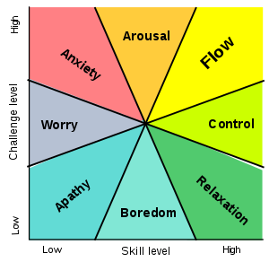

# Chapter 5: Thinking

_Remember: You don't need to be an expert to XP effectively._ You just need to exercise mindfulness.

Think about:
* _What_ you're doing
* _Why_ you're doing it
* _Whether_ it's a good idea

## Table of Contents
* [Pair Programming](#pairing)
* [Energized Work](#energy)
* [Informative Workspace](#info)
* [Root-cause Analysis](#roots)
* [Retrospectives](#retros)

## Pair Programming
###### Audience: Programmers, Everyone

#### Why Pair?
* When you have a __driver__ and __navigator__, one person focuses on writing code and the other thinks about the big picture.
_Be careful not to be an annoying/annoyed navigator, let the driver do their job._
* You get to spend more time in a ***flow state***, plus you're more able to take on challenges and more resilient to interruption.

* It's fun!

#### How to Pair
* Always be willing to make or join a new pair.
* You should switch pairs multiple times a day.
__Rishi Note:__ Personally, this is one of the few thins I really questioned. Let me know if you agree. :)
* Be physically comfortable.
* Talk about what you're doing throughout the process.
* Expect to be tired at the end. You should have accomplished a lot.

#### Driving and Navigating
* The roles will feel more natural with time. Both people should be patient with the driver, their job is inherently slower.
* Navigator: you have the opportunity to support the team by using your extra time not writing code to think more about the problem. Write your ideas down so you don't have to interrupt the driver.
* The navigator has the opportunity look things up as the driver tries ideas out.
* Switch roles frequently, especially when things feel stale and you need a fresh perspective.

#### Pairing Stations
* Lots of room for two people/computers.
* __Splurge__ on large monitors.
* __Rishi Note__: At my last job we had a plethora of wireless trackpads and keyboards so two people could control the computer in casenp we wanted to switch off.

#### Challenges
* Comfort: Stay comfy y'all, and if you love coffee/garlic, have some gum on hand.
* Mismatched Skills: Use this as an opportunity to learn. __Give everyone a chance to be an expert.__
* Communication Style: Don't be blunt, but be comfortable sharing your thoughts.
* Tools and Keybindings: Don't be a basement-dwelling programmers. Tools are meant to help, not hinder. Some teams enforce a common set of tools.

## Energized Work
###### Audience: Coaches, Everyone

Even though we're professionals, we want to be motivated daily so we can do our best work.

#### How to be Energized
* Take care of yourself, both at home and at work.
* Give yourself quality time off, but be focused while on the job.

#### Supporting Energized Work
* Remind people to go home on time and take quality time off.
* Offer healthy, energizing foods.
* Make sure the work is intellectually challenging, automate low-brainpower tasks, and make goals achievable.
* Triage away meetings or set aside time where no one can be interrupted.

#### Taking Breaks
* A good break may help you see the problem from a new perspective.
* Breaks take many forms: snacks, walks, coffee runs, going home.
* You can identify someone who needs a break: frustration, cursing, _going dark_.
* If you have a tough time telling someone to take a break, you can coax them away from their work by asking for some help.

#### Challenges
* Time: Make sure you're checking frequently enough so people can go home/do other stuff.
* Energy: If you sprint all the time, you're liable to burn out.

## Informative Workspace
###### Audience: Everyone

Access to information gives the team the ability to passively take in data, and incorporate it into their work. It should be physically congruous to the space.

#### Subtle Cues
* The feel of the room is important. Team members should feel comfortable talking, joking, and celebrating with one another.
* If possible, provide information to team members without their needing to ask for it.
* There should be opportunities for communication: whiteboards, index cards, etc.

#### Big Visible Charts
* >  The goal of a big visible chart is to display information so simply and unambiguously that it communicates even from across the room. (pg. 87)
* Examples: iteration and release planning boards, team calendar, etc.

#### Process Improvement Charts
* These should be short lived, until their goal is achieved.
* Everyone needs to agree that they want these, and that they're willing to keep them up to date.
* Your process improvement charts should reflect your organization and your team's goals.
* Don't go overboard, but make these stand out.

#### Gaming
* You don't want team members working simply to game the charts, and this can cause counter-productive effects or behavior.
* Be comfortable taking down charts if this starts to happen.
* Don't use these charts in performance evaluations, or for intra-team reporting.

#### Challenges
* Remote Team Members: Be creative in getting them the information, or become comfortable using digital tools as a last resort.

__Rishi Note__: In my last company, we had a ton of remote workers and a satellite office. Using and teaching our suite of digital information tools became second nature to everyone.
* Keeping Charts Relevant: Make sure the entire team is actually bought into the chart, or else they won't update it.

## Root-Cause Analysis
###### Audience: Everyone

When things go wrong, blame the process. And then ask: how can we fix the process so it doesn't happen again?

#### How to Find the Root Cause
* Keep asking why. Up to five times, to find the cause of the cause of the cause of the cause of the cause. Hopefully this cause^5 is the root cause.
* Usually this leads to some kind of inefficiency in a low-level design that may alleviate each of the problems up the cause chain.

#### When Not to Fix the Root Cause
* Try to solve one big problem at a time, and if you have the bandwidth solve low-hanging fruit at the same time.
* This isn't a guarantee that you'll prevent every mistake. Make sure your solution is worth the overhead of implementing it. At some point, every problem will reach a root cause that's out of your control. This doesn't mean you should give up on the problem, understand what you _can_ control and work in that space.

>  It’s better to make
it difficult for people to make mistakes than to expect them always to do the right thing. (pg. 93)

## Retrospectives
###### Audience: Everyone

How do you identify new problems in an ever-changing environment? Retros!

#### Types of Retrospectives
* Iteration Retro: at the end of each iteration
* Longer, milestone retrospectives: Release Retro, Surprise Retro, Project Retro (maybe you want someone from outside the team to run these)

#### How to Conduct an Iteration Retrospective
* Make sure your facilitator is experienced and neutral, but once things are rolling, be comfortable rotating the facilitator.
* These should be team-only, so everyone feels comfortable voicing their opinion.
* Time-box retros, but understand they may go long at first.
* You can follow the following schedule at first, but don't hesitate to experiment once comfortable.

#### An Example Retrospective
##### Step 1: The Prime Directive
> Regardless of what we discover today, we understand and truly believe that everyone did the best job they could, given what they knew at the time, their skills and abilities, the resources available, and the situation at hand. (pg. 95)

* Make sure everyone agrees with this, or at the very least can set aside their skepticism for the retro.
* By waiting for verbal agreement, you encourage more participation by team members.

##### Step 2: Brainstorming (30 minutes)

* Use the following categories to organize ideas: Enjoyable, Frustrating, Puzzling, Same, More, Less
* Which ideas do you want to see change? Which do you want to see stay the same? Write these on index cards.
* Any topic is fair game, and feel free to anonymize if it encourages people to share.
* Don't hesitate to let the silence stretch out, this may draw out new ideas.

##### Step 3: Mute Mapping (10 minutes)

* Organize all the cards in clusters. Put related cards close, and unrelated cards further apart.
* No talking.
* At the end you should have categories of discussion, based on these clusters. Outliers can have their own categories. Try to name the categories after making the clusters, and don't move index cards once their clustered.
* Vote on which categories get priority of discussion and implementation. Everyone gets five votes, but they can put them where they please.  

##### Step 4: Retrospective Objective (20 minutes)

* Choose the winner category to focus on. _In the event of a tie, just pick one._
* If your favorite category lost, it's ok. If it's really important it'll show up again.
* Read through some of the cards, and try to apply solutions to any problems that come up. Use your root-cause analysis here.
* Once you have different solutions, have the group vote on one. This is your _retrospective objective_. The whole team will work on this until the next retrospective. Figure out how to track this goal and who is responsible for details.

#### Challenges
* Lack of support from higher up: Focus, again, on what you _can_ fix.
* Blame and confrontation: Figure out the root cause of this. If it is a particular group of people, have conversations with them beforehand. Encourage people who clash to work on their conflicts outside of the retro. In extreme cases, take a break or bring in outside help.
* Lack of progress on goals: Maybe you're thinking too big, or don't have enough slack in your day-to-day.
* Not enough participation: Try using the prime directive to break the ice.
* One group is continuously disenfranchised: If after a few iterations, the process seems to favor against one particular group of people or problems, give them more votes if it's a healthy way to level the playing field.
* Time: Realize these are worth your time, but it may help to be more decisive in leading the conversation.

# THANKS FOR READING
